# (C# 코딩) FIleCompare

## 개요
- C# 프로그래밍 학습
- 1줄 소개: C#으로 구현한 파일 비교 프로그램
- 사용한 플랫폼:
  - C#, .NET Windows Forms, Visual Studio, GitHub
- 사용한 컨트롤:
  - TextBox, Button, Label, ListBox, ListView, Panel, SplitContainer
- 사용한 기술과 구현한 기능
  - 폴더 선택 기능
  - 파일 리스트 기능
  - 파일 비교 기능
  - 파일 복사 기능
  - 하위 폴더 처리 기능
  - 색상 구분 표시 기능
  
  

## 실행 화면 (과제1)
-  과제1 코드의 실행 스크린샷

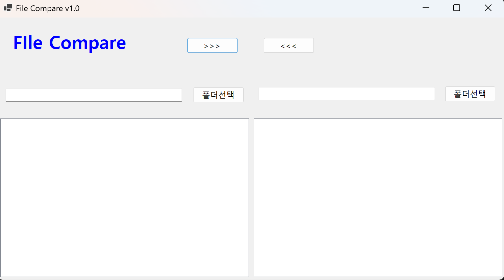
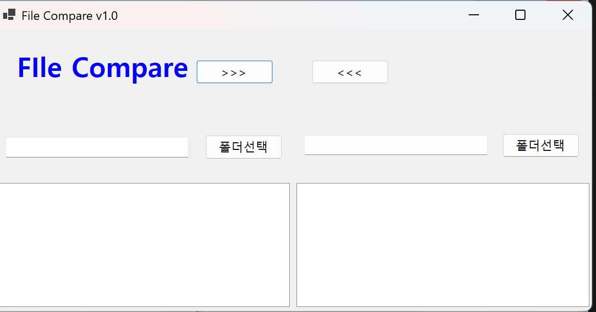
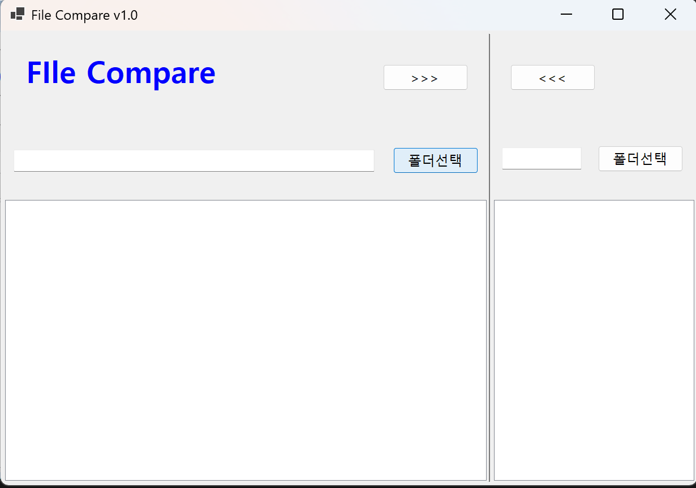

- 과제 내용
  - UI 구성
    - ▶GUI 설계
    - ▶컨트롤 배치
  - 컨트롤의 기본 기능 확인과 구현
    - ▶컨트롤에서 기본적으로 제공하는 기능 구동 확인
    - ▶다시 주문할 수 있도록 초기화합니다.

- 구현 내용과 기능 설명
  - 폴더 선택과 파일 리스트를 위한 SplitContainer 사용, 각 패널에 ListBox와 Button 배치
  - 폴더 선택 버튼과 파일 리스트가 명확하게 구분되도록 배치
  - SplitContainer의 Panel1과 Panel2에 각각 ListBox와 Button을 배치하여 폴더 선택과 파일 리스트 기능을 명확하게 구분
  - SplitContainer를 사용하여 하나의 화면을 두 부분으로 사용할 수 있게 함
  

## 실행 화면 (과제2)
-  과제2 코드의 실행 스크린샷

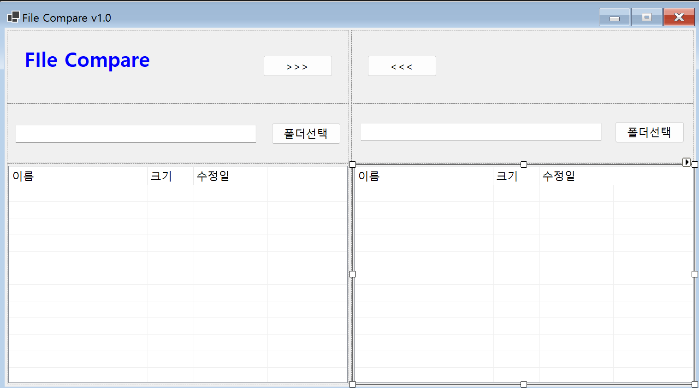
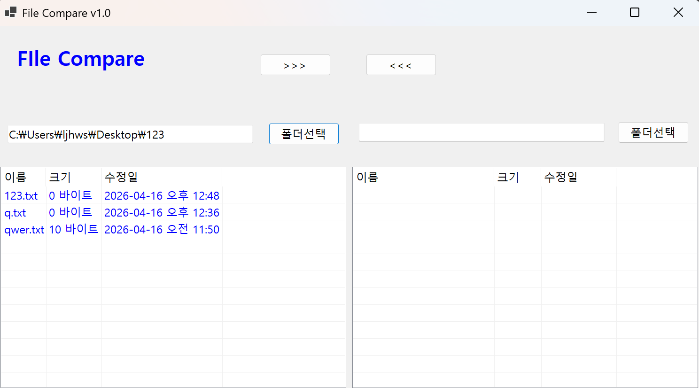
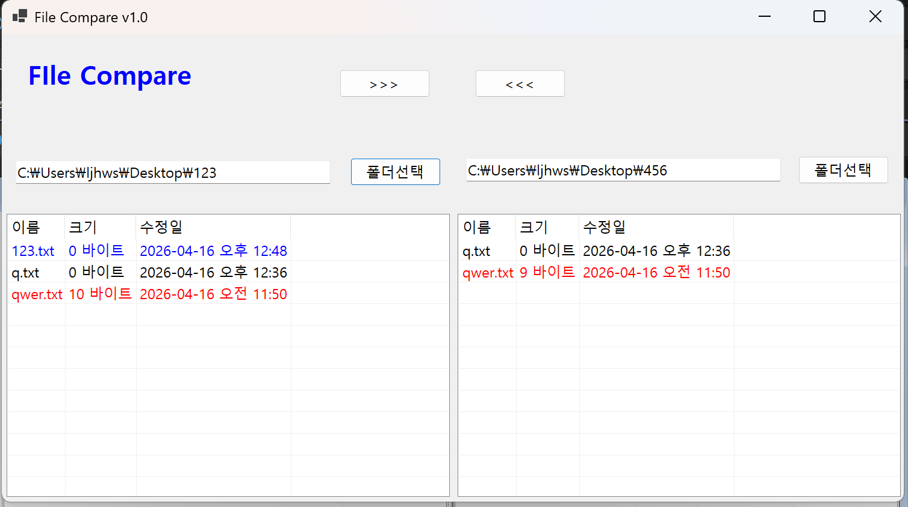

- 과제 내용
  - 폴더 선택 기능과 파일 리스트 기능 구현(색상 구분 표시)

- 구현 내용과 기능 설명
  - 폴더 선택 버튼 클릭 시 폴더 브라우저 대화상자 표시하여 폴더 선택 기능 구현
  - 선택한 폴더의 파일 리스트를 ListBox에 표시하는 기능 구현
  - 파일 리스트에서 파일의 상태에 따라 색상으로 구분하여 표시하는 기능 구현
  

## 실행 화면 (과제3)
-  과제3 코드의 실행 스크린샷

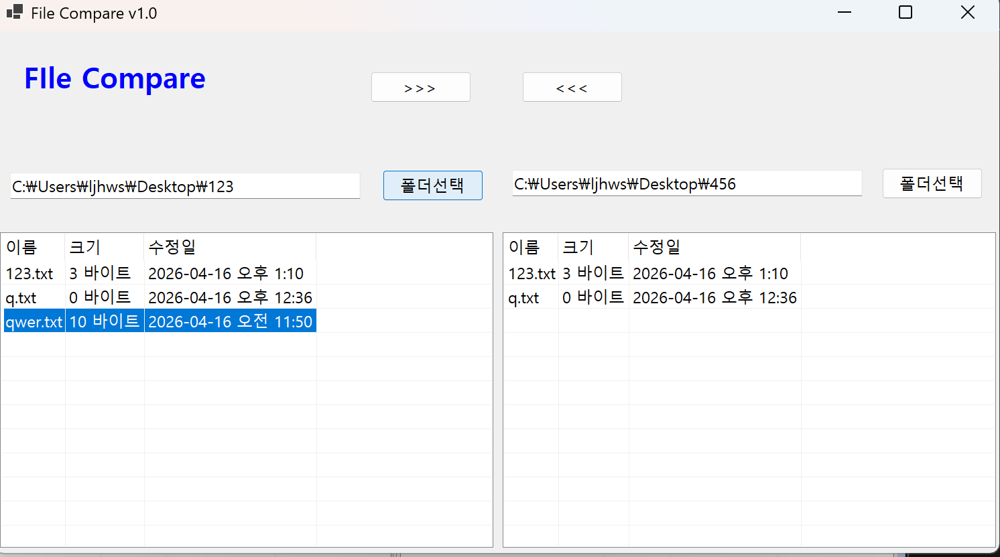
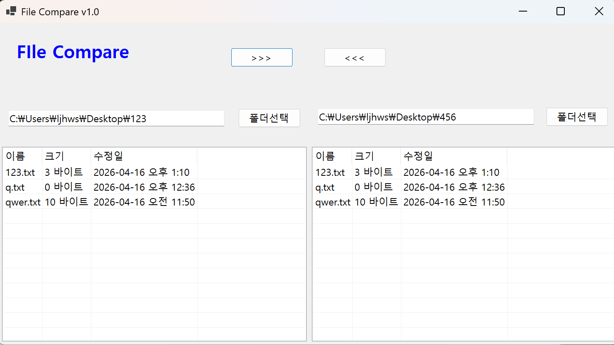
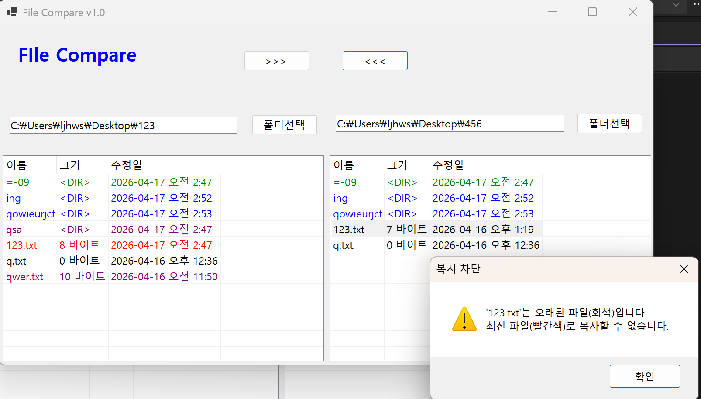

- 과제 내용
  - 선택한 파일을 반대쪽 폴더로 복사하기
  - 수정된 날짜 정보를 확인해서 “확인” 받아 진행 여부 결정하기

- 구현 내용과 기능 설명
  - 파일 리스트에서 파일을 선택하고 복사 버튼 클릭 시 선택한 파일을 반대쪽 폴더로 복사하는 기능 구현
  - 파일 복사 전에 수정된 날짜 정보를 확인하여 사용자에게 확인 메시지를 표시하고, 사용자가 확인하면 복사 진행하는 기능 구현

## 실행 화면 (과제4)
-  과제4 코드의 실행 스크린샷

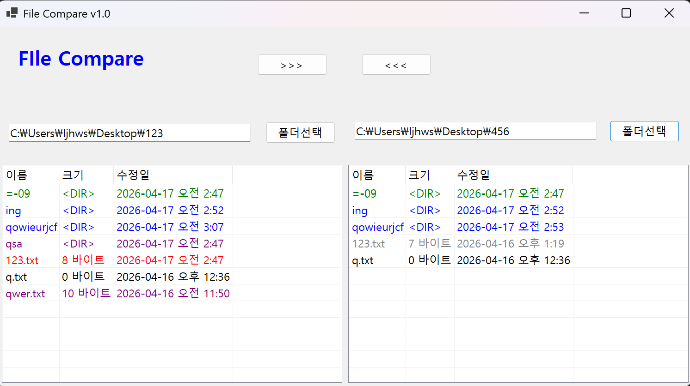
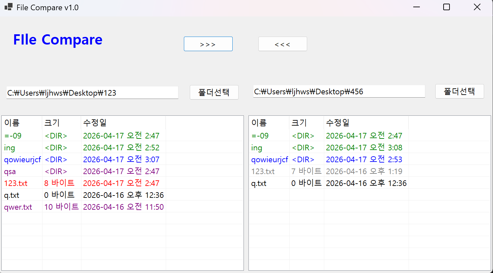

- 과제 내용
  - 하위폴더를 하나의 파일처럼 처리
  - 적절하게 색상 표시
  - 복사 버튼 누르면 하위폴더의 모든 내용(파일과 하위폴더 포함) 처리

- 구현 내용과 기능 설명
  - 하위 폴더를 하나의 파일처럼 처리하여 폴더 리스트에 표시하는 기능 구현
  - 하위 폴더의 상태에 따라 색상으로 구분하여 표시하는 기능 구현
  - 복사 버튼 클릭 시 하위 폴더의 모든 내용(파일과 하위 폴더 포함)을 처리하여 복사하는 기능 구현
 